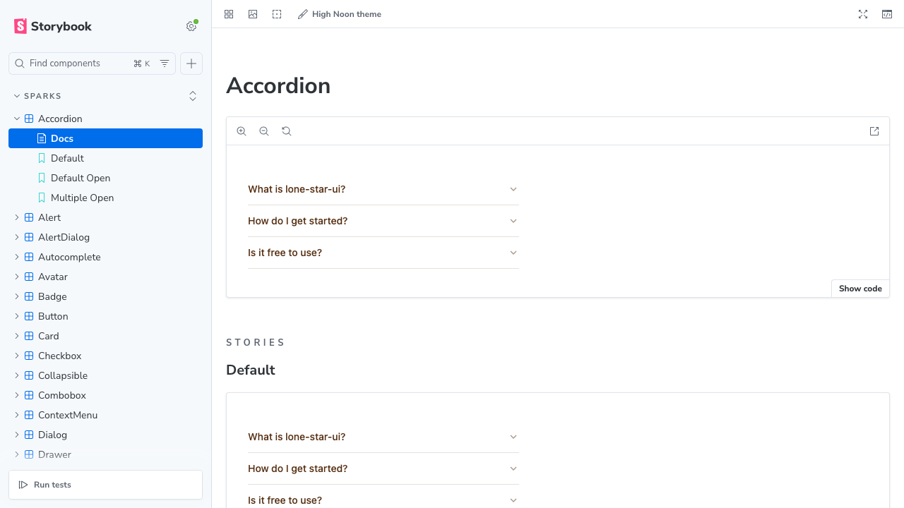

# Rivet UI

[](https://www.npmjs.com/package/rivet-ui)
[](./LICENSE)

A React 19 component library built with TypeScript, Tailwind CSS 4, and CVA (Class Variance Authority). Publishes ESM-only to npm with full type declarations.



## Installation

```bash
bun install rivet-ui
```

Peer dependencies: `react`, `react-dom`, and `typescript`.

## Usage

Import components and the required stylesheet:

```tsx
import "rivet-ui/styles";
import { Button } from "rivet-ui";
```

Subpath imports are available for tree-shaking:

```tsx
import { Button } from "rivet-ui/button";
```

## Theming

All design tokens are CSS custom properties, so you can override them in your own stylesheet:

```css
:root {
  --color-ribbon: oklch(58% 0.10 185);
  --color-mustard: oklch(72% 0.12 75);
  --color-kraft: oklch(35% 0.04 55);
  --color-denim: oklch(45% 0.12 250);
  --color-canvas: oklch(95% 0.01 75);
  --color-spool: oklch(55% 0.15 25);
  --color-surface: #fdfbf7;
  --font-display: 'Inter', sans-serif;
}
```

### Available tokens

| Token | Default (light) | Description |
| --- | --- | --- |
| `--color-ribbon` | `oklch(58% 0.10 185)` | Muted teal — focus rings, links |
| `--color-mustard` | `oklch(72% 0.12 75)` | Warm ochre — warning states |
| `--color-kraft` | `oklch(35% 0.04 55)` | Warm brown — text/borders |
| `--color-denim` | `oklch(45% 0.12 250)` | Muted navy — primary actions |
| `--color-canvas` | `oklch(95% 0.01 75)` | Warm cream — neutral backgrounds |
| `--color-spool` | `oklch(55% 0.15 25)` | Terracotta — destructive/error |
| `--color-surface` | `#fdfbf7` | Page/card background |
| `--font-display` | `'Lora', Georgia, serif` | Heading/display font |

Dark mode tokens are automatically redefined when the `.dark` class is applied.

### Fonts

The display font (Lora) is **not** loaded automatically. To use it, either:

```css
@import 'rivet-ui/fonts';
```

Or add a `<link>` tag to your HTML, or override `--font-display` with your own font.

### Variant utilities

CVA variant configs are exported so you can apply library styles to custom elements:

```tsx
import { buttonVariants } from 'rivet-ui';

<a href="/login" className={buttonVariants({ variant: 'primary', size: 'lg' })}>
  Log in
</a>
```

The `cva` function and `VariantProps` type are also re-exported for building your own variant-driven components:

```tsx
import { cva, type VariantProps, cn } from 'rivet-ui';
```

## Development

```bash
bun install              # Install dependencies
bun run build            # Build library (Bun.build + tsc declarations)
bun run dev              # Build in watch mode
bun run storybook        # Start Storybook dev server on port 6006
bun run build-storybook  # Build static Storybook
bun run typecheck        # Type-check without emitting
```

## Architecture

Each component lives in `src/components/<Name>/` with three files:

- `<Name>.tsx` — implementation using CVA for variants + `cn()` for class merging
- `<Name>.stories.tsx` — Storybook stories with interactive `play` tests
- `index.ts` — barrel export

Styling uses Tailwind CSS 4 with CSS custom properties in oklch color space. Consumers must import `rivet-ui/styles` for Tailwind classes to work.

## Contributing

See [CONTRIBUTING.md](./CONTRIBUTING.md) for guidelines on how to get started.

## License

[MIT](./LICENSE)
